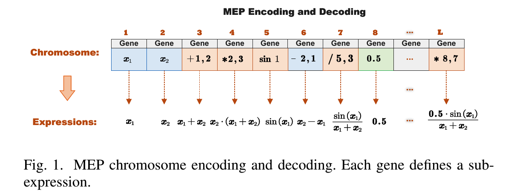
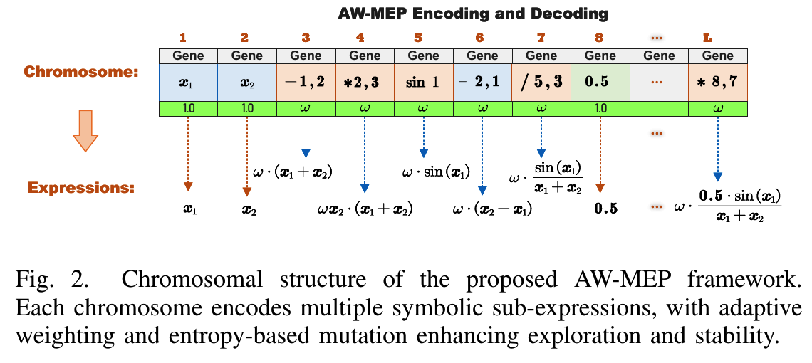
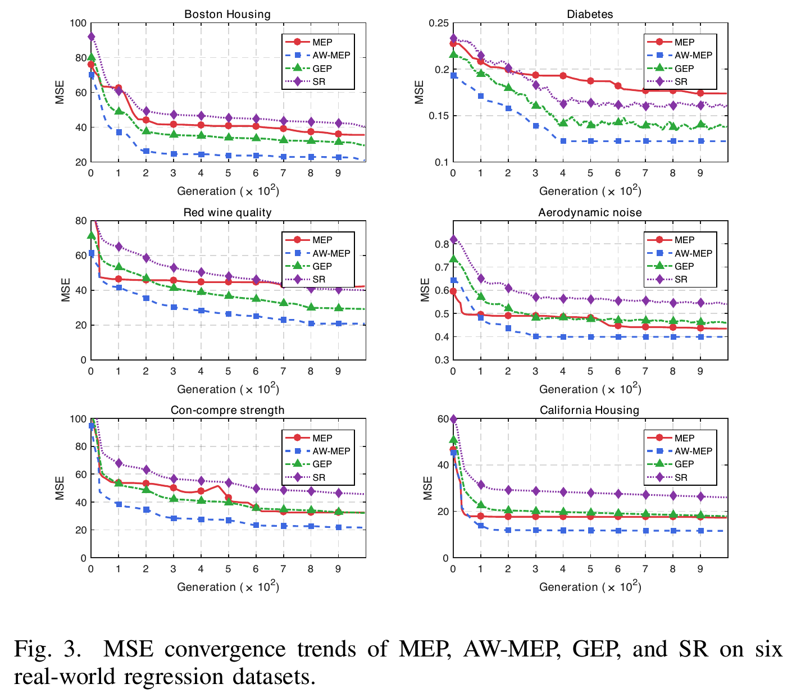
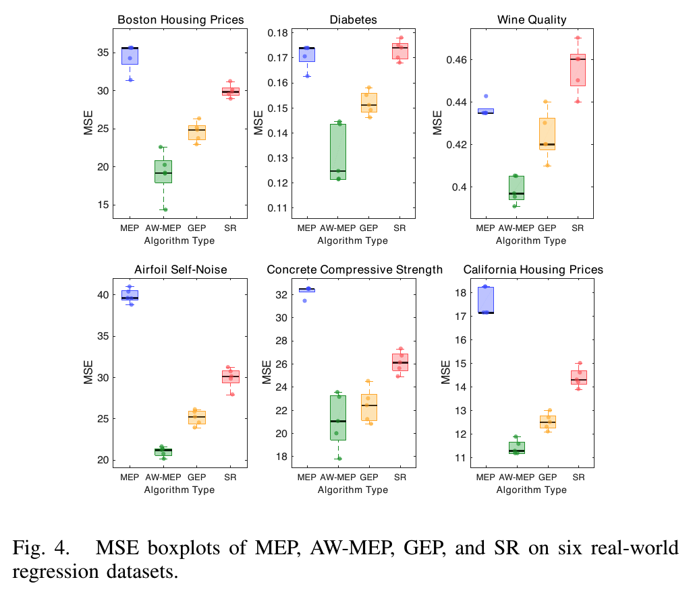

# Adaptive Weighted Multi-Expression Programming for Symbolic Regression  

[](LICENSE) [](https://github.com/tsingke/AW-MEP) [](https://github.com/tsingke/AW-MEP/stargazers)  

**Title**: Adaptive Weighted Multi-Expression Programming with a Self-Regulating Evolutionary Framework for Symbolic Regression

```
 Authors：Xin Yin, Qingke Zhang*，Xiaolin Wang, Lingyu Lv, Na Wang, Shengnan Zhang, Shuang Gao, Huaxiang Zhang
```
> School of Computer Science and Artificial Intelligence, Shandong Normal University, Jinan 250358, China
> 
> Corresponding Author: **Qingke Zhang** ， Email: tsingke@sdnu.edu.cn ， Tel :  +86-13953128163

## 1. Overview  
Symbolic regression focuses on discovering **interpretable mathematical expressions** to model complex nonlinear relationships in data. Traditional Multi-Expression Programming (MEP) is elegant, yet often limited by premature convergence, fixed operator schemes, and sub-optimal exploration–exploitation balance. To overcome these limitations, we introduce **Adaptive Weighted Multi-Expression Programming (AW-MEP)** — a novel framework that integrates multiple self-regulating mechanisms for dynamic control of evolution. AW-MEP is designed to deliver improved convergence, higher generalization, and enhanced search efficiency for real-world symbolic modeling tasks.  

## 2. Repository Structure

```text
AW-MEP/
├── Pictures/                 # Figures and visualization materials
├── code/                     # Source code for AW-MEP
├── datasets/                 # Benchmark and real-world datasets
├── LICENSE                   # MIT License
└── README.md                 # Project overview and instructions
```
## 3. Innovations  
1. **Dynamic Operator Weighting Strategy**: Continuously assesses and updates the importance of genetic operators based on contribution feedback, guiding search direction and eliminating redundant operations.  
2. **Entropy-Guided Adaptive Mutation Rate**: Maintains population diversity and avoids stagnation by self-adjusting mutation intensity in response to entropy feedback.  
3. **Weighted Crossover + Elitist Preservation**: A refined genetic manipulation scheme combining weighted recombination and elitist retention to accelerate convergence without losing diversity.  
4. **Volcanic Simulated Annealing (VSA)**: Periodic energy-based perturbation enables the population to escape local optima and improves global search capability.  

## 4. Schematic Diagram 


<p align="left">
  
 
  
</p>


<p align="left">
  
 
</p>


##  5. License

This project is licensed under the MIT License — see the LICENSE file for details.

 ## 6. Acknowledgements

**We would like to express our sincere gratitude to editors and the anonymous reviewers for taking the time to review our paper.** 

This work is supported by the National Natural Science Foundation of China (Grant No. 62006144) 
